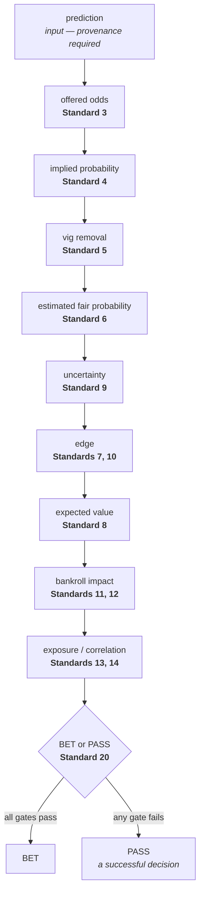

# Betting and Gambling Decision Standards

**Prediction standards determine whether a prediction deserves belief. These standards determine
whether that prediction, at the offered price and under the applicable risk constraints, deserves
money.**

> **A good bet can lose. A bad bet can win.**
> Bet quality is determined from information available at decision time — not the eventual outcome.
> **PASS is always a legitimate, successful decision.**

This is not a document collection. It is an auditable system: 21 numbered standards, 51 machine-readable
rules, and tooling that re-derives every number in a wagering decision and disagrees when it does not
follow from its inputs.

## What it does

| Question | Answered by |
| --- | --- |
| What must be done? | 25 rules at `level: required` |
| What should normally be done? | 3 rules at `level: recommended` |
| **What must never be done?** | **23 rules at `level: forbidden` — non-exemptible, STOP semantics** |
| When does a standard apply? | `applicability` in `project-policy.yml`, with a mandatory reason |
| What evidence demonstrates compliance? | Decision records, audit findings, human attestations |
| How is compliance verified? | Re-derivation of every recorded number, plus the decision rule |
| When must a decision be revisited? | `revisitWhen`, attestation digests, policy digest pinning |

## Quick start

```bash
npm test                      # 159 tests, zero dependencies
npm run check                 # re-derive every number in the worked examples
npm run validate              # the verdict, with honest coverage
node scripts/standards.mjs explain bankroll.no-martingale
```

To adopt it in your own project:

```bash
node <path-to-this-repo>/scripts/standards.mjs init . --dry-run
```

## Contributing: local CI and verified pull requests

The full pipeline runs in Docker on your machine, and it is what gates a pull request. GitHub stays
the review system; it is not what proves the branch passes.

```powershell
.\scripts\ci.ps1          # run the complete pipeline in an ephemeral container
.\scripts\submit-pr.ps1   # verify, then push exactly what was verified, then open the PR
```

> **The commit pushed for a PR is exactly the commit that passed the complete local Docker CI
> pipeline.**

Eight stages, declared once in [`ci/pipeline.json`](ci/pipeline.json) and shared with
`.github/workflows/ci.yml` so the two cannot drift. See **[docs/local-ci.md](docs/local-ci.md)** for
prerequisites, isolation behaviour, debugging a failed container, and the limits of the guarantee —
and [ADR 0007](artifacts/adr/0007-local-docker-ci-as-the-authoritative-gate.md) for why the local run
is the authoritative one.

## The standards

| # | Standard | Prohibitions it carries |
| --- | --- | --- |
| 1 | [The Fundamental Invariant](standards/01-the-fundamental-invariant.md) | resulting (both directions) |
| 2 | [The Decision Pipeline](standards/02-the-decision-pipeline.md) | priceless recommendations |
| 3 | [Odds Conversion](standards/03-odds-conversion.md) | fabricating odds |
| 4 | [Implied Probability](standards/04-implied-probability.md) | |
| 5 | [Vig](standards/05-vig.md) | ignoring vig |
| 6 | [Fair Probability](standards/06-fair-probability.md) | gambler's-fallacy reasoning |
| 7 | [Edge](standards/07-edge.md) | probability-only bets, fabricating edge |
| 8 | [Expected Value](standards/08-expected-value.md) | unsupported +EV claims, fabricating EV |
| 9 | [Uncertainty Discount](standards/09-uncertainty-discount.md) | hiding uncertainty, "guaranteed" |
| 10 | [Minimum Edge](standards/10-minimum-edge.md) | |
| 11 | [Bankroll Management](standards/11-bankroll-management.md) | |
| 12 | [Unit Sizing](standards/12-unit-sizing.md) | chasing, Martingale, loss-driven sizing, "due" |
| 13 | [Maximum Exposure](standards/13-maximum-exposure.md) | breaching caps |
| 14 | [Correlated Bets](standards/14-correlated-bets.md) | ignoring correlated exposure |
| 15 | [Line Movement](standards/15-line-movement.md) | fabricating line movement |
| 16 | [Stale Predictions](standards/16-stale-predictions.md) | |
| 17 | [Closing-Line Value](standards/17-closing-line-value.md) | |
| 18 | [Record Keeping](standards/18-record-keeping.md) | silently altering history |
| 19 | [Evaluation of the Betting Process](standards/19-evaluation-of-the-betting-process.md) | lookahead backtests |
| 20 | [Pass Decisions](standards/20-pass-decisions.md) | action bets, bet quotas |
| 21 | [Prohibited Behaviors and the Integrity Invariant](standards/21-prohibited-behaviors-and-the-integrity-invariant.md) | weakening a standard |

## The decision pipeline

Each stage consumes the last. Skipping one does not leave a visible gap — it leaves a number computed
from something other than what it claims.



## Verdicts

| Verdict | Meaning |
| --- | --- |
| `COMPLIANT` | Everything that was checked passed. |
| `COMPLIANT_WITH_EXCEPTIONS` | As above, with recorded, unexpired exceptions. |
| `NON_COMPLIANT` | A required rule failed. Fix it and re-run. |
| `NOT_EVALUATED` | Nothing was evaluated. **Never a pass.** |
| `BLOCKED_BY_INVARIANT` | A prohibition was violated. **Stop and report.** |

Exit codes are load-bearing: `0` success, `1` verdict failure, `2` input unreadable. **A `2` is never
reported as non-compliance** — "the policy could not be read" and "this project does not comply" are
different facts.

## What this pack will not claim

Every verdict ships with a coverage figure, kept out of the score so that improving coverage can never
look like improving compliance. `COMPLIANT` means *everything that was checked passed* — not that
everything was checked.

Eight rules report `not-evaluated` and always will. They prohibit motives and ways of reasoning —
chasing a loss, betting for action, judging a decision by its result, leaking future information into
a backtest — and none of those appears in any record. A text scan for the word "due" would catch the
careless case, miss the substance, flag honest prose, and report an assurance this pack does not have.
Those rules pass only through a recorded human attestation, and an attestation never overrides an
automated finding.

Two limits are worth reading before trusting any clean report:

- **Nothing inside a ledger can show what was left out of it.** A wager placed and never recorded is
  invisible to every exposure cap and every metric ([Standard 18](standards/18-record-keeping.md) R1).
- **A human with commit access can change anything here.** The integrity invariant's guarantee is not
  that weakening is impossible, but that it cannot be *silent*
  ([Standard 21](standards/21-prohibited-behaviors-and-the-integrity-invariant.md) R5).

## Layout

```text
standards/          21 numbered normative documents
rules/              13 category files — the machine-readable catalog
schemas/            decision record, betting policy, project policy
scripts/            the CLI, the betting arithmetic, and the invariant checks
test/               159 tests, including one known-negative per detectable prohibition
examples/           5 worked decisions, 5 walkthroughs, 23 violation documents
templates/          what an adopting project copies, including AGENTS.md
design/             the concept model and the architecture/milestone plan
artifacts/prompts/  both governing briefs, committed untouched
artifacts/adr/      8 accepted decision records
docs/               architecture and the pipeline diagram
```

## Commands

| Command | Job | Exit |
| --- | --- | --- |
| `standards init <dir> [--dry-run]` | Bootstrap a project. Never overwrites. | 0, 1 on conflict |
| `standards plan <dir>` | What would be evaluated, and what evidence it needs. | 0, 2 |
| `standards check [<dir>]` | Re-derive and re-evaluate decision records, against that directory's own `betting-policy.yml`. | 0, 1, 2 |
| `standards audit <dir>` | Evidence: every finding, no verdict. | 0, 2 |
| `standards validate <dir>` | The verdict, with coverage. **The CI gate.** | 0, 1, 2 |
| `standards explain <rule-id>` | What a rule means and how it is checked. | 0, 1 |
| `standards status <dir>` | Orientation. Informs; never gates. | 0, 2 |

Every command handed a directory judges that directory against **the policies inside it** —
`project-policy.yml` for which rules apply, `betting-policy.yml` for what the numbers are. This
repository's own `betting-policy.yml` governs the worked examples in `examples/ledger` and nothing
else. A project that has not declared its thresholds is not lent these: `check` exits 2, and
`validate` reports the rules that need them as unevaluated rather than passing them against numbers
nobody wrote down. See [ADR 0008](artifacts/adr/0008-the-target-owns-the-policy-it-is-judged-against.md).

Plus the repository's own invariant checks: `npm run inventory`, `npm run fidelity`,
`npm run policy`, `npm run diagrams`.

## For AI agents

Read [`templates/AGENTS.md`](templates/AGENTS.md). The short version: run `status` → `plan` → build the
record → `check --record <draft> --dry-run` before committing it → `validate`. Never edit a decision
record after writing it. Never declare an exception against a prohibition — it is rejected and
reported. On `BLOCKED_BY_INVARIANT`, stop and report; do not reclassify the rule or lower a threshold.

You are never required to produce a positive recommendation. PASS is always available, there is no bet
quota, and a period with no wagers is a valid outcome.

## Design

- [`design/concept-model.md`](design/concept-model.md) — each of the brief's fifteen candidate
  concepts, adopted, adapted, or rejected, with reasoning.
- [`design/architecture-and-milestones.md`](design/architecture-and-milestones.md) — the layers, the
  three-way separation, and how the integrity invariant is defended.
- [`artifacts/adr/`](artifacts/adr/) — six accepted decisions, including the prediction boundary and
  why this repository vendors its machinery rather than depending on anything.

## Version

2.0.0 · zero dependencies · Node >= 18 · see [CHANGELOG.md](CHANGELOG.md)
