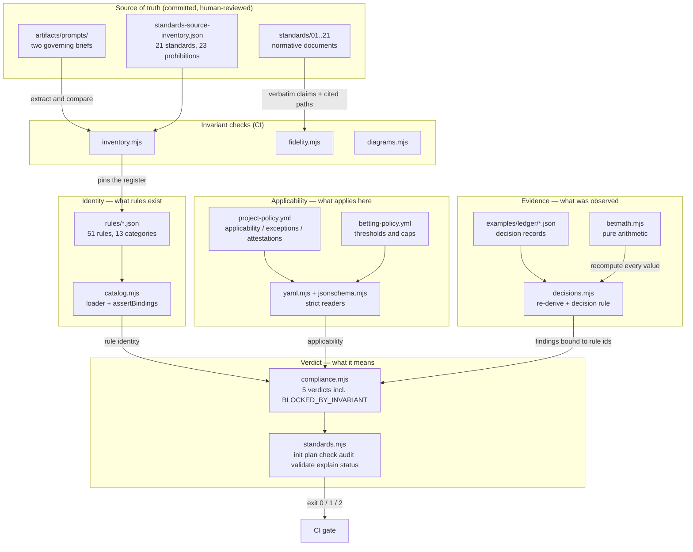

# Architecture — BettingStandards

> A standalone, auditable standards system for betting and gambling decisions. It answers one
> question — does this prediction, at this price, under these risk constraints, justify risking money
> — and it answers it in a way that can be checked rather than believed. The consumers are bettors
> and, explicitly, AI agents: the pack is designed so an agent can determine what applies, gather
> evidence, evaluate compliance, and refuse to proceed.

This is not a service. There is no server, no database, and no network I/O. It is a set of normative
documents, a machine-readable rule catalog, and a command-line tool that reads files and exits with a
meaningful code. Sections of the usual architecture template that do not apply — runtime processes,
background jobs, HTTP endpoints, schema tables, external integrations — are omitted rather than
padded.

## Tech Stack

| Layer | Technology |
|---|---|
| Runtime | Node.js >= 18, ESM (`"type": "module"`) |
| Dependencies | **None.** Zero third-party packages, enforced structurally — `.github/workflows/ci.yml` has no install step, so adding a dependency breaks the build (ADR 0006) |
| Parsing | Hand-written: `scripts/yaml.mjs` (strict YAML subset), `scripts/jsonschema.mjs` (JSON Schema 2020-12 subset) |
| Data formats | JSON for machine-written decision records; YAML for human-authored configuration |
| Tests | `node:test` + `node:assert/strict` — 159 tests across 9 files |
| Diagrams | Mermaid, text-compared rather than rendered (keeps the zero-dependency guarantee) |

## The three-way separation

Everything rests on one architectural rule, enforced mechanically by `assertBindings` in
`scripts/catalog.mjs`:

```text
The catalog (rules/*.json)      defines rule identity and metadata.
The policy (project-policy.yml) defines project applicability.
The evaluator (scripts/)        produces evidence.
None of the three may redefine the others.
```

Without a mechanical guard, an evaluator grows its own private vocabulary of rule names one detector
at a time, and within a week the audit and the policy describe different worlds. `assertBindings`
throws if any detector reports an id the catalog does not define.

## Components

### `scripts/betmath.mjs` — the arithmetic

**Responsibility:** every betting calculation in the pack. Pure functions, no I/O, no state, no clock.

Exports `decimalFromAmerican`, `americanFromDecimal`, `decimalFromFractional`, `impliedFromDecimal`,
`overround`, `fairProbsMultiplicative`, `edge`, `evPerUnit`, `evPerUnitWithPush`, `adjustedEdge`,
`adjustedProb`, `kellyFraction`, `stakeFromKelly`, `unitStake`, `bankrollPercent`, `exposureTotals`,
`clvPercent`, `profitUnits`, `roundTo`, `nearlyEqual`.

Two rules govern the module, both about honesty rather than mathematics:

1. **Never return NaN or Infinity.** Every domain violation throws `BetMathError`. A NaN reaching a
   report is a false green wearing a number — `NaN >= minEdge` is false and so is `NaN <= cap`, so a
   record full of NaN passes every gate meant to stop it.
2. **Compute at full precision; round only when recording.** `roundTo` exists for writing values into
   a record and nothing else. Chained rounding produced a real one-cent disagreement during
   development, caught by the checker doing its job.

There is deliberately **no `shouldBet()`**. Expected value is an input to a decision, never the
decision.

Tolerances are part of the contract: `TOL_PROB = 5e-7 + 1e-12`, `TOL_MONEY = 0.005 + 1e-9`. The
trailing slack exists because a value landing exactly on a rounding boundary differs from the true
value by precisely a half-unit, and in binary the subtraction lands a hair above it — a tolerance of
exactly half rejects correctly rounded values.

### `scripts/decisions.mjs` — the decision checker

**Responsibility:** re-derive every recorded number, then re-evaluate the decision rule independently
of what the record decided.

Per record: JSON parse → schema validation → digest recomputation → re-derivation of every `derived.*`
field → decision-rule gates → prose scan. Then across records: id uniqueness, open-exposure
consistency, and the loss-escalation sequence scan.

**The decision rule.** A BET requires *all* of: adjusted edge at or above `minEdge` (a tie meets it);
positive expected value; stake at or below the recommended stake; stake within `maxSingleBetPct`;
group and total exposure within their caps; price and prediction inside their age limits; decision
recorded before event start; longshot discount floor met. Anything else is a PASS.

**The contemplated-stake subtlety.** Gates for a PASS are evaluated against the *recommended* stake,
not the actual zero. A PASS stakes nothing, so checking zero against an exposure cap clears it by
construction — and a PASS taken *because* a cap would break could then only record `discretionary`,
making a disciplined refusal indistinguishable from a shrug.

Exports `FINDING_RULES`, mapping all 25 finding ids to the catalog rule each binds to.

### `scripts/catalog.mjs` — rule identity

Loads `rules/*.json` into one catalog, validating every entry. Two domain-specific narrowings from the
reference framework: no alias mechanism (ADR 0003), and no `optional` level or `info` severity.

It **refuses to define a forbidden rule that is not also `nonExemptible` with `severity: "error"`**,
so the prohibition guarantee cannot be lost through an omission in a single entry.

### `scripts/compliance.mjs` — the verdict engine

Turns catalog + policy + findings into one of five verdicts:

| Verdict | Meaning |
|---|---|
| `COMPLIANT` | Every applicable, evaluated rule passed |
| `COMPLIANT_WITH_EXCEPTIONS` | As above, with recorded unexpired exceptions |
| `NON_COMPLIANT` | A required rule failed |
| `NOT_EVALUATED` | Nothing was evaluated — never a pass |
| `BLOCKED_BY_INVARIANT` | A prohibition was violated — stop, do not proceed |

Blocking is checked **before** required failures: a run that is both non-compliant and blocked must
report blocked, because "fix these and re-run" is the wrong instruction for someone who has just
ignored the vig or edited a settled record.

A finding's *severity* decides whether a required rule fails, not the rule's level alone — a stale
price behind a PASS is advisory, and escalating it to a failure would make correct behaviour report as
non-compliance.

### `scripts/standards.mjs` — the CLI

Seven subcommands, designed around this domain's two workflows rather than copied from a generic
framework:

| Command | Job | Exit codes |
|---|---|---|
| `init <dir> [--dry-run]` | Bootstrap a project; never overwrites | 0, 1 on conflict |
| `plan <dir>` | What would be evaluated and what evidence it needs | 0, 2 |
| `check [<dir>]` | Re-derive and re-evaluate decision records | 0, 1, 2 |
| `audit <dir> [--strict]` | Evidence: every finding, no verdict | 0, 2 |
| `validate <dir>` | The verdict with coverage — the CI gate | 0, 1, 2 |
| `explain <rule-id>` | What a rule means, how it is checked, STOP semantics for prohibitions | 0, 1 |
| `status <dir>` | Orientation; informs, never gates | 0, 2 |

`buildPlan()` produces one evaluation-plan object consumed by `plan`, `audit`, and `validate`, which
is what makes `plan` an accurate preview rather than a second implementation that drifts.

`EVALUATED_RULES` is an explicit list of the rules the evaluator genuinely examines. Everything not in
it reports `not-evaluated`. A test asserts no `manual-review` rule ever appears in it.

### `scripts/init.mjs` — bootstrap

`plan(dir, root)` decides what would happen, touching nothing; `apply(dir, operations)` executes
exactly that plan. Dry-run and apply share the one plan object — a dry-run that derives its own idea
of the work is not a preview of anything.

Three actions: `create`, `skip` (the file exists and came from this framework), and `conflict` (it
exists and did not — left untouched and reported). Ownership is detected by a marker comment, or by
content identity for JSON, which cannot carry one.

### Invariant checks

| Script | What it proves |
|---|---|
| `inventory.mjs` | The standards series and prohibition register have not silently changed shape. Extraction is compared *against* the human-reviewed inventory, never re-derived — so a parser that grows more or less forgiving can only disagree, not redefine |
| `fidelity.mjs` | Every block claiming to be verbatim source is verbatim, and every `examples/` path a standard cites exists |
| `policy.mjs` | Both policies against their schemas; owns the single `coerceNumber` that turns policy strings into numbers |
| `diagrams.mjs` | Mermaid sources match their embedded copies — text comparison, no rendering |

## The decision record

The unit of evidence (ADR 0004). One JSON file per decision, BET and PASS alike.

| Block | Mutability | Contents |
|---|---|---|
| `decision` | **Immutable**, covered by `integrity.decisionDigest` | Every pipeline stage value at decision time: event, prediction, market (with the *full* market), uncertainty discount, bankroll, open exposure, correlation group, policy reference, all derived values, the decision, pass reasons, rationale |
| `integrity` | — | SHA-256 over the canonically serialized decision block |
| `outcome` | Appended later, **outside** the digest | Closing price, CLV, result, profit, settlement time, process review |

Two structural properties do most of the work. `fullMarket` requires every outcome, which is what
makes ignored vig mechanically detectable at all. And `outcome` sitting outside the digest is what
lets the pack insist that bet quality is judged from decision-time information while still tracking
what happened — appending a result cannot disturb what was decided.

`policyRef.digest` pins the betting policy each decision was made under, so relaxing a threshold later
never retroactively re-judges past decisions.

## Data flow — one `validate` run

1. `standards.mjs main()` parses arguments and dispatches to `runValidate`.
2. `buildPlan(dir)` loads the catalog via `catalog.mjs`, reads `project-policy.yml` through
   `yaml.mjs`, and classifies every rule as automated, needs-attestation, not-applicable, or
   not-evaluated.
3. `gatherEvidence(plan)` refuses outright unless the project's declared `standardVersion` is the
   version this checkout executes, then calls `checkDecisions()` in `decisions.mjs`, which refuses on
   the same grounds again before opening anything. Those are two of the three authorities that
   produce evidence in this pack — `checkPolicy()` in `policy.mjs` is the third — and each guards what
   it establishes; see ADR 0009 for why the guard is not in the commands, and
   `test/evidence-surface-census.test.mjs` for the derived inventory that keeps the list of three
   honest. For each record in `examples/ledger/` (or `ledger/` in an adopting project),
   `checkDecisions` recomputes every derived value through `betmath.mjs` and re-evaluates the
   decision rule.
4. Policy-level and document-level detectors add findings for thresholds, caps, and required
   documents.
5. `assertBindings()` throws if any finding names a rule the catalog does not define.
6. `evaluate()` in `compliance.mjs` applies applicability, rejects exceptions declared against
   prohibitions, judges attestations against content digests, and produces the verdict.
7. `envelope()` wraps it with `frameworkCoverage` — deliberately outside the score, so improving
   coverage never looks like improving compliance.
8. Exit `0`, or `1` on `NON_COMPLIANT`/`BLOCKED_BY_INVARIANT`, or `2` if a policy or schema could not
   be read. **A 2 is never reported as non-compliance.**

## Component map



## Key patterns & conventions

- **Never let a skip count as a pass.** A rule nothing evaluated reports `not-evaluated`; an empty
  ledger reports that nothing was evaluated. A false red has a complainant; a false green has none, by
  construction. Canonical example: `evaluate()` in `scripts/compliance.mjs`.
- **The number is never the verdict.** Expected value does not authorise a wager; the score does not
  grant compliance; coverage ships beside the verdict and is never folded into it.
- **Assurance is declared per rule, and the notes say what a check does *not* establish.** Arithmetic
  that re-derives is `full`; field presence is `partial`; motive is `none` with `manual-review`.
  Canonical example: `rules/record.json`.
- **Known-negative fixtures, one defect each.** `test/fixtures/ledger-negative/` holds 15 records that
  each break exactly one thing, so a test asserts a *specific* finding rather than "something failed".
  `boundary-edge-exact-min.json` is deliberately **valid** — it guards the tie-meets-threshold rule,
  which no other test would notice regressing.
- **Mutation-test the checks.** Delete a branch or reintroduce a defect and a test must go red.
  `test/jsonschema.test.mjs` carries an explicit `MUTATION:` case.
- **Dry-run and apply share one plan object.** `scripts/init.mjs`, and `buildPlan()` for
  plan/audit/validate.

## Entry points for common tasks

| Task | Where to start |
|---|---|
| Add or change a rule | `rules/<category>.json` — then update `artifacts/standards-source-inventory.json` in the same commit, or `npm run inventory` fails |
| Add a normative requirement | `standards/NN-*.md` — Scope, Requirements (`### RN — …`), Additions beyond the source, Relationship, Implementation |
| Add a betting calculation | `scripts/betmath.mjs`, plus a known-answer vector in `test/betmath.test.mjs` computed by hand rather than captured from a run |
| Add a check on decision records | `scripts/decisions.mjs` — add the finding id to `FINDING_RULES` and a fixture under `test/fixtures/ledger-negative/` |
| Make a rule machine-evaluated | Add its id to `EVALUATED_RULES` in `scripts/standards.mjs` — the test suite rejects any `manual-review` rule there |
| Change a threshold | `betting-policy.yml`. Read `examples/violations/integrity.no-standard-weakening.md` first |
| Adopt the pack elsewhere | `INSTRUCTIONS.md`, then `standards init <dir> --dry-run` |

## Known gaps

Stated here as well as in the catalog, because a reader of the architecture should not have to find
them rule by rule.

- **Ledger completeness is unverifiable.** Nothing inside a ledger can show what was left out of it. A
  wager placed and never recorded is invisible to every exposure cap and every metric. Standard 18 R1
  carries this, and `exposure.no-cap-breaches` names it as a load-bearing assumption.
- **Eight rules can never be machine-evaluated.** They prohibit motives — chasing, action bets,
  resulting, "due" theory, gambler's-fallacy reasoning, backtest leakage — plus review cadence and the
  integrity invariant. They report `not-evaluated` until attested.
- **The integrity invariant cannot detect its own circumvention.** A rule able to do that would have
  to run outside the system it protects. Five mechanical defences exist (Standard 21 R4); the honest
  limit is that a human with commit access can change anything, so the guarantee is that weakening
  cannot be *silent*.
- **Fabrication is detectable only structurally.** A plausible invented price with complete provenance
  fields is indistinguishable from a real one to any check here.
- **No SVG is generated.** `docs/architecture.mmd` is the canonical source and is embedded above
  byte-identically; `npm run diagrams` enforces the match by text comparison. Rendering an SVG would
  require a headless browser, which would end the zero-dependency guarantee — so the diagram is
  committed as source only, deliberately.
