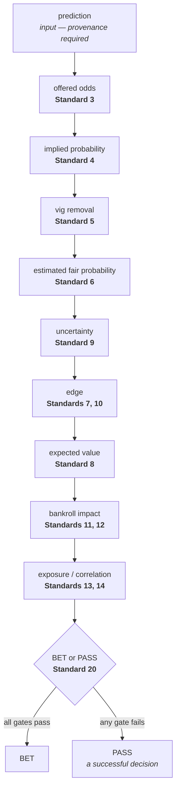

# Standard 2 — The Decision Pipeline

A wagering decision is a sequence of stages, each consuming the last. Skipping one does not leave a
visible gap — it leaves a number computed from something other than what it claims, and the result
still looks like a complete answer.

This standard fixes the sequence, requires every decision to traverse it, and marks where this pack
begins and ends.

Source: the "Decision pipeline" section of
[`artifacts/prompts/original-prompt.md`](../artifacts/prompts/original-prompt.md).

## Scope

Applies to every wagering decision, whether it ends in a BET or a PASS, and whether it is made by a
person or an agent.

## Requirements

### R1 — The stages, in order

Reproduced verbatim from the source:

```text
prediction
→ offered odds
→ implied probability
→ vig removal
→ estimated fair probability
→ uncertainty
→ edge
→ expected value
→ bankroll impact
→ exposure/correlation
→ BET or PASS
```

Each stage is owned by a standard: prediction is an input (R2 below), offered odds by
[Standard 3](03-odds-conversion.md), implied probability by [Standard 4](04-implied-probability.md),
vig removal by [Standard 5](05-vig.md), fair probability by [Standard 6](06-fair-probability.md),
uncertainty by [Standard 9](09-uncertainty-discount.md), edge by [Standard 7](07-edge.md) and
[Standard 10](10-minimum-edge.md), expected value by [Standard 8](08-expected-value.md), bankroll
impact by [Standards 11](11-bankroll-management.md) and [12](12-unit-sizing.md), exposure and
correlation by [Standards 13](13-maximum-exposure.md) and [14](14-correlated-bets.md), and the
terminal decision by [Standard 20](20-pass-decisions.md).

### R2 — The prediction is an input, and this pack does not evaluate it

The pipeline begins with a probability estimate that something else produced. Whether that estimate
deserves belief — whether the model is sound, the data clean, the method appropriate — is not this
pack's question and is not re-litigated here.

What this pack requires of the input is provenance: the estimate names its source and the time it was
made ([Standard 6](06-fair-probability.md) R2, [Standard 16](16-stale-predictions.md) R1). An
estimate with no source cannot be told apart from a number chosen to justify a wager.

The boundary, stated once so the rest of the pack can rely on it: **prediction standards determine
whether a prediction deserves belief; these standards determine whether that prediction, at the
offered price and under the applicable risk constraints, deserves money.** Recorded as ADR 0001.

### R3 — Every stage is recorded

A decision record carries a value for every stage. Where a stage genuinely does not apply, that is
declared explicitly with a reason — never left absent, because an absent stage and a skipped stage
look identical afterwards.

### R4 — No wager is recommended without the offered price

**A wager MUST NOT be recommended, suggested, or placed without the offered price entering the
decision.** A recommendation with no price attached is void, not merely weak: without a price there
is no implied probability, no edge, and no expected value — only an opinion about who will win.

The price is not one input among several. It is the input that makes the others mean anything, which
is why this prohibition sits on the pipeline rather than on any single later stage.

### R5 — The pipeline terminates in exactly BET or PASS, before the event starts

There is no third outcome. A pipeline that can end in "maybe" or "monitor" has not decided anything,
and an undecided decision cannot be recorded, checked, or learned from.

The decision is recorded before the event begins. A decision timestamped at or after the start is
not a prediction about an uncertain event.

## Additions this standard makes beyond the source

The source gives the stage list and the words "Where applicable". Everything else is this pack's:

- R2's treatment of the prediction as an opaque, provenance-carrying input, and the boundary
  statement. The source says only that this pack must remain separate from prediction standards; how
  the separation is realised — as an artifact contract rather than a cross-pack rule reference — is
  a decision recorded in ADR 0001.
- R3's reading of "where applicable" as *declare the exception explicitly* rather than *omit the
  stage*. This is the substantive interpretation in this standard, and it is what makes a skipped
  stage detectable at all.
- R5's requirement that the decision precede the event start.
- The assignment of each stage to an owning standard.

## Relationship to other standards

Every standard from 3 to 14 owns one stage of this pipeline. [Standard 18](18-record-keeping.md)
defines the record that carries the stage values. [Standard 20](20-pass-decisions.md) governs the
terminal decision and establishes that PASS is a success rather than an absence.

## Implementation

**Met.** `decision.pipeline-complete` is evaluated on every record: the schema requires a value for
every stage, the checker re-derives each one from the stage before it, and a decision recorded at or
after the event start reports `post-start-decision`.

**Partially met.** `decision.no-priceless-recommendations` carries `assurance: partial`. It
establishes that a price is present in every *recorded* decision. A recommendation made outside the
ledger — in a message, a conversation, a spreadsheet — is not visible to it, and the catalog says so.

The pipeline is drawn in [`docs/diagrams/decision-pipeline.mmd`](../docs/diagrams/decision-pipeline.mmd),
with each stage labelled by the standard that owns it. That diagram is the visual index of this pack,
and `npm run diagrams` fails if the copy embedded below drifts from it.


